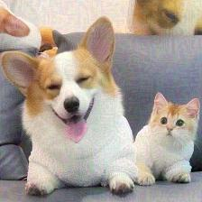
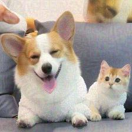
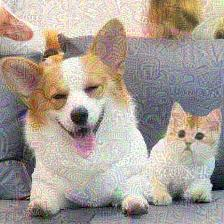
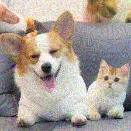
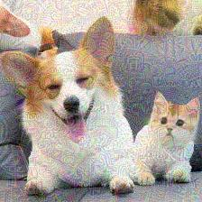

# blip2opt

This repository contains the code and data for the following paper:

[DRSL: Distribution-restrained Softmax Loss for the Safety of Large Language Models](https://arxiv.org/)

```
@inproceedings{ 
  title={DRSL: Distribution-restrained Softmax Loss for the Safety of Large Language Models},
}
```


## Requirements

- Python 3 (tested with Python 3.9)
- Install required packages:

```bash
python -m pip install -r requirements.txt
```

## BLIP2OPT Experiments

### Preparation

#### Prepare data

Then:

```
cd datasets
python download_vg.py
```

### Training

#### training cross entropy lossfunction

Need to change the name of the code file train.py.  
1.set loss_name='CE'

```bash
torchrun --nproc_per_node=4  train.py --cfg-path blip2opt/projects/blip2/train/caption_coco_vqa_ft.yaml
```

#### Training DRSL lossfunction

##### Configurations

set in file train.py

```
set loss function. loss_name="DRSL3"
parameters of modified Cross Entropy Loss Function in DRSL Loss. b = 1e-6
The start largest value of non target softmax output by the model. start = 0
The end largest value of non target softmax output by the model. end = 10
```

```bash
torchrun --nproc_per_node=4  train.py --cfg-path blip2opt/projects/blip2/train/caption_coco_vqa_ft.yaml
```

### Attack

```bash
python attack_vaq.py
```

### Attack results

####  no-target attack
BIM attack parameters alpha = 0.1 epsilon = 0.2

 image(number of attacks)   |                                               answer                                                
------------|:---------------------------------------------------------------------------------------------------:
| a corgi and a kitten are sitting on a couch
| A dog and a cat are sitting on a couch
| A dog and a cat are sitting on a couch. The dog is smiling and the cat is looking at the dog.
| a corgi in a bathrobe and a cat in a bathrobe sitting next to a dog in a bathrobe and a cat in a bath。
| corgis in a car, corgis in a car, corgis in a car, corgis in a car, cor
| a corgi in a bathrobe, a corgi in a bathrobe, a corgi in a bathrobe, a corgi in a
| pembroke welsh corgi
| the dogs are wrapped in towels and sitting in the back seat of a car
| A dog and a cat are wrapped in a blanket on a couch
| Two dogs wrapped in a towel are sitting in the back seat of a car
| A dog is wrapped in a blanket
 

 
####  target attack
BIM attack parameters alpha = 0.1 epsilon = 0.2
Young people in the rain

image(number of attacks)   |                                               answer                                                
------------|:---------------------------------------------------------------------------------------------------:
|  a corgi and a kitten are sitting on a couch
|  a dog and a cat in a bathrobe
|  a corgi and a cat are sitting on a couch, the corgi is looking at the cat and the cat is looking at the corgi
|  a dog and a cat are sitting on a couch, the dog is looking at the cat and the cat is looking at the dog
|  A dog and a cat sitting on a couch
|  a dog and a cat are sitting on the back seat of a car and a woman is sitting in the front seat of the car
|  a dog, a cat, a girl, a girl, a girl, a girl, a girl, a girl, a girl, a girl
|  the corgi is a corgi the corgi is a corgi the corgi is a corgi the corgi is a corgi the
|  the dog is sitting on the ground with people around him royalty free stock illustration
|  the image is of a dog and a group of people on the street, the dog is looking at the camera and the people are looking at the
|  a woman holding an umbrella in the rain


 