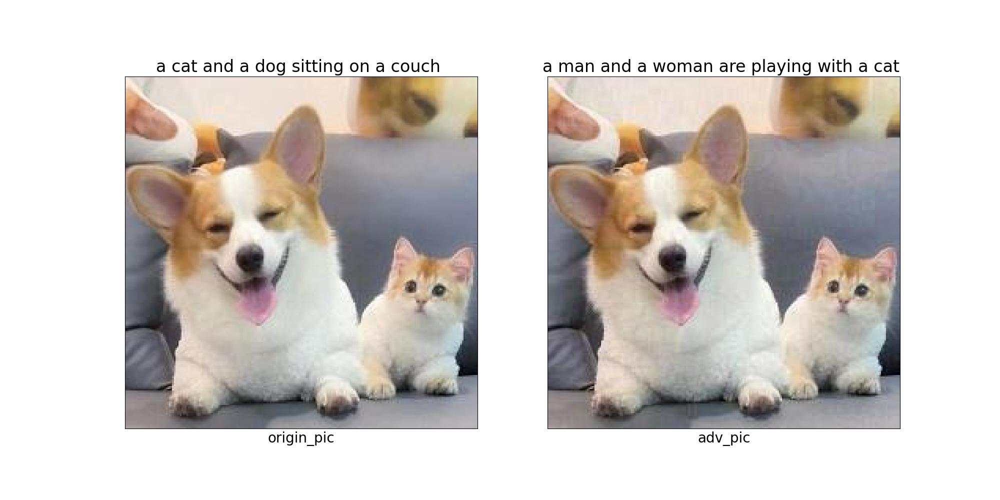

# vitgpt2

This repository contains the code and data for the following paper:

[DRSL: Distribution-restrained Softmax Loss for the Safety of Large Language Models](https://arxiv.org/)

```
@inproceedings{ 
  title={DRSL: Distribution-restrained Softmax Loss for the Safety of Large Language Models},
}
```

## Requirements

- Python 3 (tested with Python 3.9)
- Install required packages:

```bash
python -m pip install -r requirements.txt
```

## VITGPT2 Experiments

### Preparation

#### Prepare data
1.download train datasets. 

 COCO2017   |                                               source                                                
------------|:---------------------------------------------------------------------------------------------------:
 images     |               <a href="http://images.cocodataset.org/zips/train2017.zip">Download</a>               
 annotation | <a href="http://images.cocodataset.org/annotations/stuff_annotations_trainval2017.zip">Download</a> 

After the data download is completed, extract it to the specified folder, and import the data using the datasets
library. Therefore, it is necessary to prepare the data in the format of datasets, as well as prepare the metadata.csv
file and place it in the train2017 folder. The content format of metadata.csv is:

 file_name        |                           text                           
------------------|:--------------------------------------------------------:
 000000391895.jpg | A man with a red helmet on a small moped on a dirt road. 
 000000522418.jpg |    A woman wearing a net on her head cutting a cake.     

a detailed tutorials on datasets can be found in [datasets](https://huggingface.co/docs/datasets/index).


```
cd datasets
python load_coco.py
```

2.download attack datasets. you can choose any open source dataset.
```
url: https://www.kaggle.com/datasets/prasunroy/natural-images
```


### Training

**training cross entropy lossfunction**  
need to change the name of the code file ddp_train_coco.py On line 102.  
- set name='CE'
```bash
torchrun nproc_per_node=4 ddp_train_coco.py
```

**training DRSL lossfunction**  
need to change the name of the code file ddp_train_coco.py    
- on line 97.set top_n=n   
- on line 102.set name='DRSL3'
```bash
torchrun nproc_per_node=4 ddp_train_coco.py -start m -end n
```


### Attack
```bash
python adv_vitgpt2.py
```


### Attack results
  


####  no-target attack
- BIM attack parameters alpha = 0.02 epsilon = 1 
- no-target attack succeeded in the 4th attack. 

 image(number of attacks)   |                                               answer                                                
------------|:---------------------------------------------------------------------------------------------------:
|  A dog and a cat are sitting on a couch.
|  A small dog is sitting on a lap top.
|  A cat is sitting in a car seat.
|  A cat is wearing a tie and a toothbrush.
|  A small white kitten is holding a toothbrush.
|  A small toothbrush is sticking out of a person's mouth.
|  A toothbrush with a toothpaste in it's mouth.
|  A toothbrush with a toothpaste in it's mouth.
|  A toothbrush with a toothpaste in it's mouth.
|  A toothbrush with a toothpaste in it's mouth.
|  A toothbrush with a toothpaste in it's mouth.

 
 
####  target attack


- BIM attack parameters alpha = 0.02 epsilon = 1 
- target:A dog and a cat are sitting on a couch.
- target attack succeeded in the 5th attack. 
 

 image(number of attacks)   |                                               answer                                                
------------|:---------------------------------------------------------------------------------------------------:
| A man on a snowboard is in the air on a snowy slope.
| A man is sitting on a snowboard in the snow.
| A man sitting on a beach with a surfboard.
| A man sitting on a bed with a laptop on it.
| A man sitting on a bed with a dog on it.
| A dog is sitting on a couch with a dog in the background.
| A dog is sitting on a couch with a dog on the couch.
| A dog is sitting on a couch with a dog in the background.
| A dog sitting on a couch with a dog on the other side of it.
| A dog is sitting on a couch with a dog in the background.
| A dog sitting on a couch with a dog in the background.
 
 


 
 
